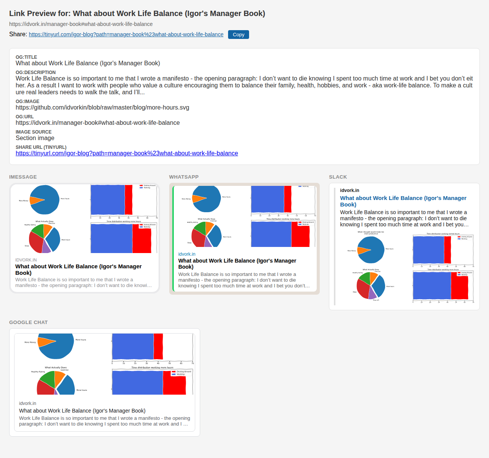

# The manager book redirect

A URL redirect service for [idvork.in](https://idvork.in/). When you share a blog link, it generates rich link previews (og:title, og:description, og:image) scraped from the actual blog content, then redirects the browser to the real page.

## Usage

### Sharing a link with rich preview

1. Copy a URL from [idvork.in](https://idvork.in/) (e.g., `https://idvork.in/manager-book#being-a-great-manager`)
2. Convert it to a share link using the `mb` alias:
   ```bash
   alias mb="pbpaste | sed 's!idvork.in/!idvorkin--igor-blog-fastapi-app.modal.run/!'| sed 's!#!/!' | pbcopy"
   ```
3. Paste the link — chat apps will show the section title, description, and image in the preview

### Previewing how a link will look

Before sharing, you can see how the link will render across platforms (iMessage, Slack, Twitter, Facebook):

```
https://tinyurl.com/igor-blog-preview?path={page}%23{anchor}
```

**Examples:**

- Preview the manager book: [tinyurl.com/igor-blog-preview](https://tinyurl.com/igor-blog-preview)
- Preview a section: [tinyurl.com/igor-blog-preview?path=manager-book%23managing-and-developing-people](https://tinyurl.com/igor-blog-preview?path=manager-book%23managing-and-developing-people)

The preview page shows the resolved `og:title`, `og:description`, and `og:image` metadata, along with mock-ups of how the link will render on each platform.



### Section-specific preview images

When you share a link with an anchor (e.g., `/manager-book/managing-and-developing-people`), the service automatically finds the first image within that section and uses it as the `og:image`. If no section image is found, it falls back to the page-level `og:image`.

For example, `managing-and-developing-people` contains a career conversation image — verify it at:
[tinyurl.com/igor-blog-preview?path=manager-book%23managing-and-developing-people](https://tinyurl.com/igor-blog-preview?path=manager-book%23managing-and-developing-people)

### Preview text API

```
https://idvorkin--igor-blog-fastapi-app.modal.run/preview_text/{page}/{anchor}
```

Returns scraped preview text as JSON (or plain text with `Accept: text/plain`).

---

## How it works

### Markdown anchor conversion

Markdown editors create a table of contents by changing headers to anchors. So `### Section title` becomes `https://base-url#section-title`.

### Redirect flow

The service converts a path to an HTML page with dynamic `og:title`, `og:description`, and `og:image`, then does a JS redirect to the real blog URL.


## Deployment

**Live service**: https://idvorkin--igor-blog-fastapi-app.modal.run

**Short URLs**:

- Share links: https://tinyurl.com/igor-blog
- Preview pages: https://tinyurl.com/igor-blog-preview

```bash
just deploy    # Deploy to Modal
just serve     # Run locally with Modal
just logs      # View deployment logs
```

### Legacy: Azure Functions (Deprecated)

The old Azure Functions service at https://idvorkin.azurewebsites.net is still available for backwards compatibility.

## Development Setup

This project uses `just` as a command runner and `uv` for Python environment and package management. Pre-commit hooks are configured for automated linting and formatting.

### Initial Setup

1.  Ensure you have `just` and `uv` installed.
    - `just`: See [installation instructions](https://github.com/casey/just#installation).
    - `uv`: See [installation instructions](https://github.com/astral-sh/uv#installation).
2.  Set up the Python virtual environment and install dependencies (defined in `pyproject.toml`):
    ```bash
    just install
    ```
3.  Activate the virtual environment:
    ```bash
    source .venv/bin/activate
    ```
4.  Install pre-commit hooks:
    ```bash
    pre-commit install
    ```

### Running Tests

- **Unit tests**: `just test`
- **E2E tests** (against deployed service): `just e2e-test`
- **All tests**: `just test-all`
- **Fast tests** (used by pre-commit): `just fast-test`

All tests run in parallel using `pytest-xdist`.

### Pre-commit Hooks

Pre-commit hooks run Ruff (Python), Biome (JSON), and Prettier (Markdown/HTML) automatically on commit. Run manually:

```bash
pre-commit run --all-files
```
